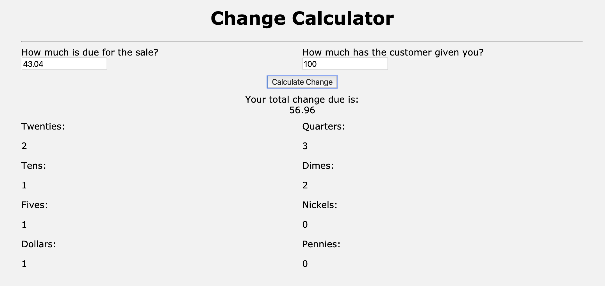

# WEB-102-Change-Calculator



Second project completed in San Diego Code School curriculum, gives a user the ability to enter a price 
for an item plus the amount received and it will calculate total change along demoninations for the pay out.
Now revised with refactored code, local express server, and minor sass styling for appearance sake.

## Please feel free to demo the project by taking these steps..
```
Clone or fork the repo
```
```
npm install
```
```
npm start
```
```
Open your browser to view on localhost: 3000
```
* **Thank you**, ***-Miles Mickelson***
